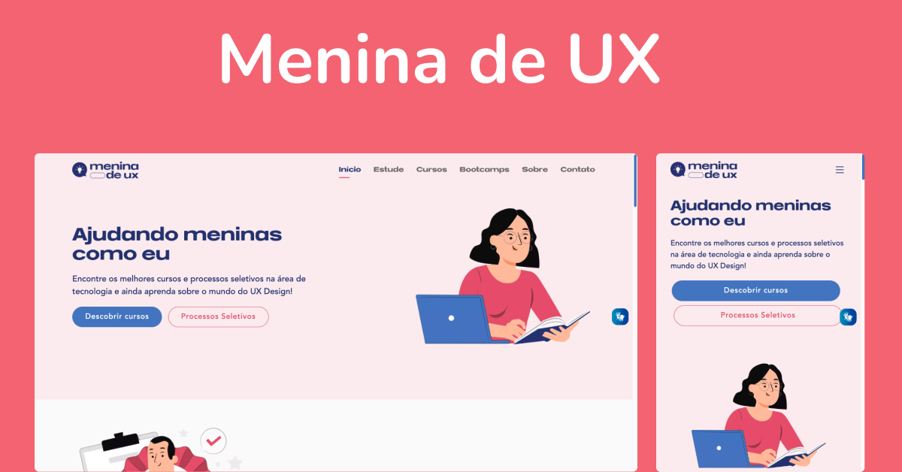

<div align="center" id="top">
  

&#xa0;

</div>

<h1 align="center">Site Menina de UX 
</h1>

<!-- <h4 align="center">
	🚧   Under construction...  🚧
</h4> -->
<!-- <hr> -->

<p align="center">
  <a href="#-sobre">Sobre</a> &#xa0; | &#xa0;
  <a href="#-paginas">Páginas</a> &#xa0; | &#xa0;
  <!-- <a href="#-as-atividades-do-projeto">Atividades do projeto</a> &#xa0; | &#xa0; -->
  <a href="#-os-objetivos-do-projeto">Objetivos do projeto</a> &#xa0; | &#xa0;
  <a href="#-links">Links</a> &#xa0; | &#xa0;
  <a href="#-tecnologias">Tecnologias</a> &#xa0; | &#xa0;
  <a href="#-requisitos-para-rodar-a-aplicação">Instalação e Configuração</a> &#xa0; | &#xa0;
  <a href="#-pull-request">Pull Request</a> 
   
</p>

<br>

## 🧠 Sobre

Tudo começou em 2021...
Quando entrei na área de UI/UX Design, fiquei apaixonada e queria muito poder mostrar os meus trabalhos por aí, além de que eu seguia profissionais da área no LinkedIn e adorava as dicas que eles davam

Então decidi criar um perfil no instagram para poder exibir meus projetos e também ensinar coisas para as pessoas

Com o tempo, fui percebendo que eu sempre gostei de educação e queria ser uma influência nessa área, poder ajudar outras pessoas com o que eu sabia (e ainda ia aprender)

Foquei para que a Menina de UX desse dicas e ensinasse coisas legais sobre design e carreira.

<br>

## 📖 Paginas

- Inicio
- Estude
- Cursos
- Bootcamps
- Sobre
- Contato

  <br>

<!-- ## 🕹 As atividades do projeto:

- Desenvolver o projeto com base no layout e nos requisitos propostos. -->

  <!-- <br> -->

## 🏆 Os objetivos do projeto:

- Ensinar e trazer conteúdos incríveis
- Trazer economia
- Capacitar jovens meninas
- Levar ensino gratuito e de qualidade para todos

<!-- ### Os resultados do projeto: -->

 <br>

## 🔗 Links:

<!-- - [Site](https://lacrei-technical-test.vercel.app/)
- [Github](https://github.com/joaotelesk/lacrei-technicalTest)
- [Figma](<https://www.figma.com/file/hzkXv2SZtiUdyneq23dAc7/Desafio-(Copy)?t=4q2VHi8Xgbkj0NQ4-6>) -->

  <br/>

## 🚀 Tecnologias

Abaixo você poderá ter acesso às principais tecnologias usadas neste projeto

- [NextJS](https://nextjs.org/)
- [TypeScript](https://www.typescriptlang.org/)
- [SASS](https://sass-lang.com/)

 <br/>

## ✅ Requisitos para rodar a aplicação

Antes de iniciar 🏁, você precisa ter [Git](https://git-scm.com) e [Node](https://nodejs.org/en/) instalado em seu sistema operacional.

<br/>

## 🏁 Iniciando

```bash
# Clone este projeto
$ git clone https://github.com/Menina-de-UX/menina-de-ux
# Acesse
$ cd menina-de-ux
# Baixe as breachs
$ git fetch --all
# Verificar todas as breachs
$ git branch -r
# Mudar para uma breachs ja criada
$ git checkout (nome da breach)
# Para criar e mudar para branch
git checkout -b developer-(seu nome)
# Instale as dependências
$ yarn
# Execute o projeto
$ yarn dev
# O projeto será inicializado em <http://localhost:3000>
```

<br/>


## ⚙️  Configuração do Eslint
 - No VSCode, clique em "command" + "p" (Macbook e Linux) ou "control" + "p" (Windows) e irá abrir um input de pesquisa.
- Escreva ">Configurações" e irá exibir uma opção com "Preferências: Abrir as Configurações do Usuário (JSON)". Clique nessa opção.
- Irá abrir um arquivo de JSON de configuração, então insira o seguinte trecho ao restante do código:

```bash
#codigo para inserir
 "editor.codeActionsOnSave": {
    "source.fixAll.eslint": true
  },

  #ou copiei todo codigo de configuração

  {
  "editor.wordWrap": "on",
  "editor.codeActionsOnSave": {
    "source.fixAll.eslint": true
  },
  "liveServer.settings.donotShowInfoMsg": true,
  "files.autoSave": "onFocusChange",
  "editor.defaultFormatter": "dbaeumer.vscode-eslint",
  "editor.formatOnSave": true,
  "editor.tabSize": 2,
  "workbench.colorTheme": "SynthWave '84",
  "workbench.iconTheme": "symbols",
  "explorer.confirmDelete": false,
  "editor.quickSuggestions": {
    "other": "on",
    "comments": "off",
    "strings": "true"
  },
  "files.associations": {
    "*.css": "\"tailwindcss\""
  },
  "javascript.updateImportsOnFileMove.enabled": "always",
  "typescript.updateImportsOnFileMove.enabled": "always",
  "symbols.hidesExplorerArrows": false,
  "workbench.productIconTheme": "fluent-icons",
  "[prisma]": {
    "editor.defaultFormatter": "Prisma.prisma"
  },
}


```

- Por último, para confirmar a configuração do ESLint, clique no ícone de engrenagem no canto inferior esquerdo, selecione "Gerenciar" e, em seguida, clique em "Configurações". Isso abrirá uma tela de navegação das configurações. Procure por "Default Formatter" e verifique se a opção está definida como ESLint. Caso não esteja, altere-a para ESLint.


## ✅ Pull requests

Antes de iniciar qualquer tesk verifique se você esta na branch correta e quando for subir para github faça da seguinte forma:

```bash
# Subir uma task para analise
$ git push origin developer-(seu nome)

```

Obs: Após isso, marque uma reunião para apresentar as modificações que você criou, para então podermos integrá-las à branch de produção.
